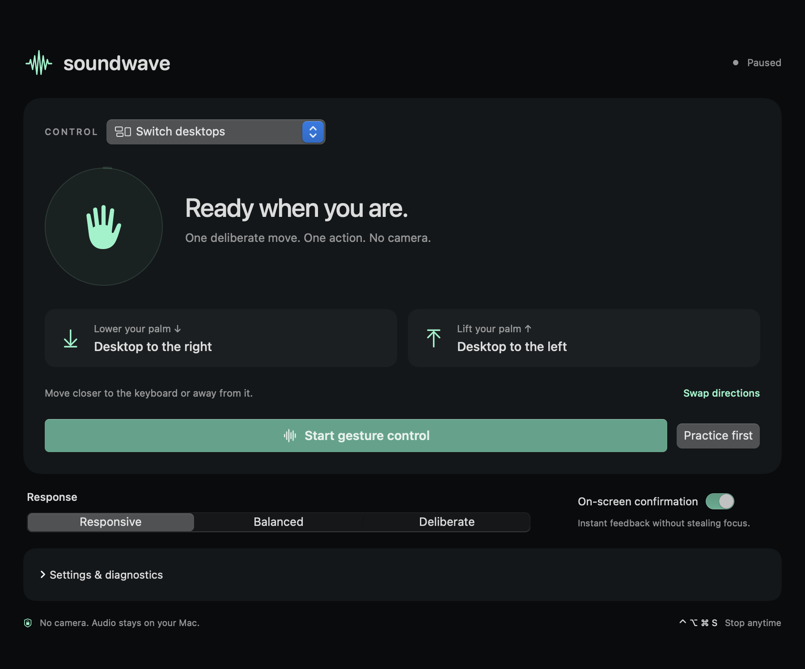

# SoundWave for Mac

Navigate your Mac with a hand gesture. Uses your speakers and microphone—no camera or wearable.

## Get started

1. Open **SoundWave** and unmute your Mac’s speakers at a comfortable, low volume.
2. Choose **Switch desktops** or another action, then click **Start gesture control**.
3. Allow Microphone and Accessibility access when asked. Keep your hand still while calibration finishes.
4. Hold your palm 15–30 cm above the keyboard. **Lower it toward the keyboard** for the desktop to the right; **lift it away** for the desktop to the left. Settle briefly between gestures.

Try **Practice first** to check both movements. Use **Swap directions** if you prefer the opposite mapping. Keep your MacBook’s lid open and wait for “Ready” between gestures.

**Stop anytime:** Control–Option–Command–S, or use the menu-bar icon.

Audio stays on your Mac. Nothing is recorded or uploaded.

Inspired by Microsoft Research’s [SoundWave: Using the Doppler Effect to Sense Gestures](https://www.microsoft.com/en-us/research/project/soundwave-using-the-doppler-effect-to-sense-gestures/).

[Build, test, and contribute →](docs/DEVELOPMENT.md)
